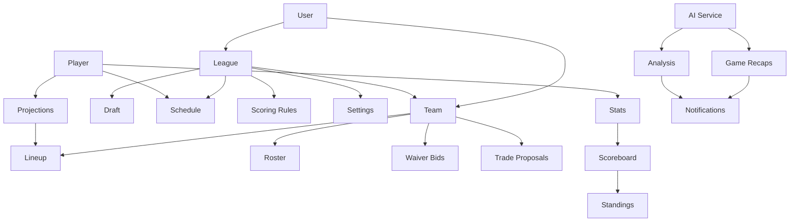

# Ultimate Fantasy Platform - Comprehensive Overview

This document provides a detailed overview of the Ultimate Fantasy platform, covering all aspects of the system from user-facing features to technical implementation details.

## Table of Contents

- [Platform Overview](#platform-overview)
- [Core Features](#core-features)
- [Multi-Sport Support](#multi-sport-support)
- [League Management](#league-management)
- [Draft System](#draft-system)
- [Lineup Management](#lineup-management)
- [Scoring System](#scoring-system)
- [Trading System](#trading-system)
- [AI-Powered Features](#ai-powered-features)
- [User Experience](#user-experience)
- [Technical Architecture](#technical-architecture)
- [API Documentation](#api-documentation)
- [Development Guide](#development-guide)

## Platform Overview

Ultimate Fantasy is a comprehensive multi-sport fantasy platform that enables users to create, manage, and participate in fantasy sports leagues across multiple sports including MLB, WNBA, and NFL. The platform supports various league formats from traditional season-long leagues to elimination-style tournaments.

### Key Capabilities

- **Multi-Sport Support**: MLB, WNBA, NFL with extensible architecture for additional sports
- **Multiple League Formats**: Traditional, Guillotine elimination, Dynasty, Keeper leagues
- **Cross-Platform Experience**: Seamless experience across web and mobile applications
- **AI-Powered Content**: Automated game recaps, analysis, and insights
- **Real-Time Updates**: Live scoring, notifications, and real-time league updates
- **Advanced Features**: Waivers, trades, draft management, lineup optimization

## Core Features

### Fantasy Sports Domain Model

The platform is built around a comprehensive domain model that supports multiple sports and league formats:



### League Management

#### League Creation & Configuration

- **Multi-Sport Support**: Create leagues for MLB, WNBA, NFL, and future sports
- **Flexible Settings**: Customizable roster sizes, scoring rules, playoff formats
- **League Types**: Traditional, Guillotine elimination, Dynasty, Keeper leagues
- **Privacy Controls**: Public, private, and invite-only leagues
- **Commissioner Tools**: Advanced settings and league management capabilities

#### Membership Management

- **Invite System**: Secure token-based invitations with expiration
- **Team Names**: Custom team names and branding
- **Capacity Management**: Configurable league sizes with waitlists
- **Role-Based Access**: Commissioner, manager, and spectator roles

### Draft System

#### Draft Types

- **Snake Draft**: Traditional serpentine draft format
- **Auction Draft**: Budget-based player acquisition (planned)
- **Linear Draft**: Straight draft order (planned)
- **Custom Draft Order**: Manual commissioner-defined order

#### Draft Features

- **Live Draft Board**: Real-time draft status and picks
- **Draft Timer**: Configurable pick timers with auto-pick
- **Queue Management**: Pre-rank players for faster drafting
- **Draft Analytics**: Pick trends and value analysis
- **Pause/Resume**: Draft interruption handling

### Lineup Management

#### Position Management

- **Sport-Specific Positions**: MLB (C, 1B, 2B, 3B, SS, OF, UTIL, P), WNBA (G, F, C, UTIL), NFL (QB, RB, WR, TE, FLEX, K, DST)
- **Lineup Locks**: Daily/weekly lineup deadlines
- **Position Eligibility**: Dynamic position eligibility rules
- **Injury Status**: Integration with injury reports

#### Optimization Features

- **Projected Points**: Player projections and scoring estimates
- **Matchup Analysis**: Head-to-head and points league optimization
- **Stacking Strategies**: Correlation plays and lineup construction
- **Value-Based Ranking**: Player value relative to position scarcity

### Scoring System

#### Scoring Categories

- **Traditional 5x5**: R, HR, RBI, SB, AVG (batting) / W, SV, ERA, WHIP, K (pitching)
- **Points Leagues**: Customizable scoring for all statistics
- **Head-to-Head**: Weekly matchups with category/point scoring
- **Rotisserie**: Season-long accumulation scoring

#### Real-Time Updates

- **Live Scoring**: Real-time stat updates during games
- **Scoreboard Updates**: Live standings and scoreboard updates
- **Push Notifications**: Score changes and lineup alerts
- **Historical Data**: Season-long stat tracking

### Trading System

#### Trade Proposals

- **Multi-Team Trades**: 2-team, 3-team, and multi-team trades
- **Trade Reviews**: Commissioner approval workflows
- **Trade Deadlines**: Configurable trade deadlines
- **Veto System**: League voting on trade fairness

#### Trade Evaluation

- **AI Analysis**: Automated trade evaluation and fairness scoring
- **Trade Calculator**: Point values and trade analyzers
- **Historical Comparisons**: Similar trade precedents
- **Market Value**: Player value tracking over time

### Waiver System

#### Waiver Types

- **FAAB (Free Agent Acquisition Budget)**: Blind bidding system
- **Rolling Waivers**: Priority-based waiver claims
- **Free Agent**: Direct free agent pickups
- **Waiver Periods**: Configurable waiver processing times

#### Waiver Features

- **Blind Bidding**: Hidden bid amounts until processing
- **Priority System**: Waiver priority management
- **Drop Requirements**: Required roster moves for acquisitions
- **Budget Management**: FAAB budget tracking and allocation

## AI-Powered Features

### Game Recaps

- **Automated Summaries**: AI-generated game recaps for all league matchups
- **Performance Analysis**: Player and team performance breakdowns
- **Key Moments**: Highlight important plays and decisions
- **Tone Control**: PG-13 content filtering and appropriate language

### Fantasy Analysis

- **Lineup Advice**: AI-powered lineup recommendations
- **Waiver Suggestions**: Player pickup and drop recommendations
- **Trade Analysis**: Trade evaluation and suggestions
- **Strategy Insights**: League-specific strategy recommendations

### Content Generation

- **Weekly Recaps**: Automated weekly league summaries
- **Season Reviews**: End-of-season analysis and awards
- **Newsletter Content**: Email content generation
- **Social Media**: Shareable content creation

## User Experience

### Cross-Platform Design

- **Responsive Web**: Optimized for desktop, tablet, and mobile web
- **Native Mobile**: React Native app with native performance
- **Consistent UI**: Shared design system across all platforms
- **Platform Adaptation**: Platform-specific UI patterns and interactions

### User Interface Features

- **Dark/Light Themes**: System-aware theme switching
- **Accessibility**: WCAG 2.1 AA compliance
- **Internationalization**: Multi-language support
- **Progressive Enhancement**: Works without JavaScript for basic functionality

### User Onboarding

- **Guided Setup**: Step-by-step league creation process
- **Interactive Tutorials**: In-app guidance and tips
- **Help System**: Context-sensitive help and documentation
- **Quick Start**: Templates for common league configurations

## Technical Architecture

### System Architecture

```mermaid
graph TB
    subgraph "Client Applications"
        A[NextJS Web App]
        B[React Native Mobile]
        C[Static Landing Page]
    end

    subgraph "Shared Packages"
        D[@ultimate-fantasy/shared-logic]
        E[@ultimate-fantasy/api-client]
        F[@ultimate-fantasy/ui-components]
    end

    subgraph "Platform Adapters"
        G[Web Adapters]
        H[Mobile Adapters]
    end

    subgraph "Backend Services"
        I[FastAPI Server]
        J[PostgreSQL Database]
        K[Redis Cache]
    end

    subgraph "External Integrations"
        L[Sports Data APIs]
        M[AI Services]
        N[Push Notifications]
        O[Analytics & Monitoring]
        P[Authentication Provider]
    end

    subgraph "Infrastructure"
        Q[Docker Containers]
        R[Load Balancer]
        S[CDN]
        T[Monitoring Stack]
    end

    A --> D
    A --> E
    A --> F
    B --> D
    B --> E
    B --> F
    C --> S

    D --> G
    D --> H
    E --> G
    E --> H
    F --> G
    F --> H

    E --> I
    I --> J
    I --> K
    I --> L
    I --> M
    I --> P

    A --> N
    B --> N
    A --> O
    B --> O

    Q --> R
    R --> A
    R --> B
    R --> I
    S --> A
    S --> B
    T --> I
    T --> Q
```

### Backend Architecture

#### Domain-Driven Design

The backend follows domain-driven design principles with bounded contexts:

- **Leagues Domain**: League creation, configuration, and management
- **Users Domain**: User management, authentication, and preferences
- **Lineups Domain**: Lineup creation, validation, and optimization
- **Scoring Domain**: Score calculation, statistics processing
- **Trading Domain**: Trade proposals, evaluation, and processing
- **Waitlist Domain**: User acquisition and onboarding

#### API Structure

- **RESTful APIs**: Resource-based API design
- **OpenAPI Documentation**: Auto-generated API documentation
- **Versioning**: API versioning strategy for backward compatibility
- **Rate Limiting**: Request throttling and abuse prevention

### Frontend Architecture

#### Shared Package System

Three main shared packages enable cross-platform development:

1. **@ultimate-fantasy/shared-logic**: Business logic, state management, utilities
2. **@ultimate-fantasy/api-client**: HTTP client and API services
3. **@ultimate-fantasy/ui-components**: Cross-platform UI component library

#### State Management

- **Global State**: Zustand stores for application state
- **Server State**: React Query for API state management
- **Local State**: React state and context for component state
- **Persistence**: Cross-platform storage abstraction

### Database Design

#### Core Entities

- **Users**: User accounts and authentication
- **Leagues**: League configurations and settings
- **Teams**: Team memberships and rosters
- **Players**: Player information and statistics
- **Lineups**: Lineup configurations and history
- **Drafts**: Draft state and pick history
- **Trades**: Trade proposals and history
- **Waiver Bids**: Waiver claims and processing

#### Relationships

- Many-to-many relationships between users and leagues
- One-to-many relationships between leagues and teams
- Many-to-many relationships between teams and players
- Versioned history for all mutable entities

## API Documentation

### Core Endpoints

#### Authentication

- `POST /auth/register` - User registration
- `POST /auth/login` - User authentication
- `POST /auth/refresh` - Token refresh
- `POST /auth/logout` - User logout

#### Leagues

- `GET /leagues` - List user's leagues
- `POST /leagues` - Create new league
- `GET /leagues/{id}` - Get league details
- `PATCH /leagues/{id}` - Update league settings
- `DELETE /leagues/{id}` - Delete league

#### Teams

- `GET /teams` - List user's teams
- `GET /teams/{id}` - Get team details
- `PATCH /teams/{id}` - Update team settings
- `GET /teams/{id}/roster` - Get team roster

#### Lineups

- `GET /lineups/{team_id}` - Get lineup for team
- `POST /lineups/{team_id}` - Create/update lineup
- `GET /lineups/{team_id}/history` - Lineup history

#### Players

- `GET /players` - Search players
- `GET /players/{id}` - Get player details
- `GET /players/{id}/stats` - Player statistics
- `GET /players/{id}/projections` - Player projections

#### Drafts

- `GET /drafts/{league_id}` - Get draft status
- `POST /drafts/{league_id}/picks` - Make draft pick
- `GET /drafts/{league_id}/board` - Draft board

#### Trades

- `GET /trades` - List trade proposals
- `POST /trades` - Propose trade
- `PATCH /trades/{id}` - Accept/reject trade
- `GET /trades/{id}/analysis` - Trade analysis

#### Waivers

- `GET /waivers` - List waiver claims
- `POST /waivers` - Submit waiver claim
- `GET /waivers/history` - Waiver history

### Data Models

#### League Model

```typescript
interface League {
  id: string;
  name: string;
  sport: "mlb" | "wnba" | "nfl";
  league_type: "traditional" | "guillotine" | "dynasty" | "keeper";
  settings: LeagueSettings;
  status: "setup" | "drafting" | "active" | "completed";
  commissioner_id: string;
  created_at: string;
  updated_at: string;
}
```

#### Player Model

```typescript
interface Player {
  id: string;
  external_id: string;
  name: string;
  position: string;
  team: string;
  injury_status: "healthy" | "questionable" | "doubtful" | "out" | "ir";
  projected_points: number;
  season_stats: Record<string, number>;
  game_stats: Record<string, number>;
}
```

#### Lineup Model

```typescript
interface Lineup {
  id: string;
  team_id: string;
  week: number;
  players: LineupSlot[];
  projected_points: number;
  actual_points?: number;
  locked: boolean;
  version: number;
  updated_at: string;
}
```

## Development Guide

### Getting Started

#### Prerequisites

- Docker and Docker Compose
- Node.js 20+ (for local development)
- Python 3.11+ (for local development)
- PostgreSQL 15+ (for local development)

#### Quick Start with Docker

```bash
# Clone repository
git clone <repository-url>
cd ultimate-fantasy

# Start all services
docker-compose up --build

# Access applications
# Web App: http://localhost:3000
# API Docs: http://localhost:8000/docs
```

#### Local Development Setup

```bash
# Install dependencies
npm install

# Start backend
npm run dev:api

# Start web app
npm run dev:web

# Start mobile app
npm run dev:mobile
```

### Development Workflow

#### Shared Package Development

```bash
# Navigate to package
cd packages/shared-logic

# Install dependencies
npm install

# Development mode
npm run dev

# Run tests
npm test

# Build package
npm run build
```

#### Testing Strategy

- **Unit Tests**: Individual function and component testing
- **Integration Tests**: Cross-package functionality testing
- **E2E Tests**: User journey testing with Playwright
- **Visual Regression**: UI consistency testing
- **Contract Tests**: API contract validation

#### Code Quality

- **TypeScript**: Strict type checking across all packages
- **ESLint**: Consistent code style and error prevention
- **Prettier**: Code formatting
- **Pre-commit Hooks**: Automated quality checks

### Deployment

#### Production Deployment

```bash
# Build all packages
npm run build:packages

# Build all applications
npm run build

# Deploy with Docker
docker-compose -f docker-compose.prod.yml up -d
```

#### Environment Configuration

- **Development**: Local development with hot reload
- **Staging**: Pre-production testing environment
- **Production**: Live production environment with monitoring

### Contributing

#### Code Standards

- Follow established patterns and naming conventions
- Write comprehensive tests for all new functionality
- Update documentation for API changes
- Use semantic versioning for releases

#### Pull Request Process

1. Create feature branch from main
2. Implement changes with tests
3. Update documentation as needed
4. Pass all CI checks
5. Create pull request with description
6. Code review and approval
7. Merge to main branch

## Conclusion

The Ultimate Fantasy platform represents a comprehensive solution for fantasy sports enthusiasts, combining modern web technologies with robust backend architecture. The cross-platform design ensures a consistent experience across all devices while the modular architecture allows for easy extension to new sports and features.

The platform's success is built on:

- **95% Code Reuse** between web and mobile applications
- **Type Safety** across all platform boundaries
- **Performance** comparable to platform-specific solutions
- **Developer Experience** with unified tooling and workflows
- **Maintainability** through modular, well-tested components

This architecture provides a solid foundation for scaling the platform while maintaining code quality and development velocity.
