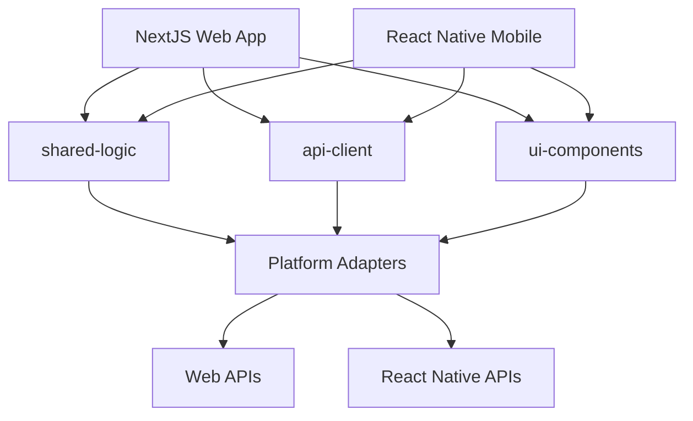

# Ultimate Fantasy - Shared Packages

This directory contains the shared packages that enable code reuse between the NextJS web application and React Native mobile app. These packages form the foundation of the cross-platform architecture.

## Package Overview

| Package | Purpose | Size | Platform Support |
|---------|---------|------|-------------------|
| [`@ultimate-fantasy/shared-logic`](./shared-logic/) | Business logic, state management, utilities | ~50KB | Web + Mobile |
| [`@ultimate-fantasy/api-client`](./api-client/) | HTTP client and API services | ~30KB | Web + Mobile |
| [`@ultimate-fantasy/ui-components`](./ui-components/) | Cross-platform UI component library | ~80KB | Web + Mobile |

## Architecture



## Key Features

### 🔄 Cross-Platform Compatibility
- **Automatic Platform Detection**: Components adapt based on web vs mobile environment
- **Storage Abstraction**: localStorage (web) ↔ AsyncStorage (mobile)
- **Navigation Abstraction**: Next.js Router ↔ React Navigation
- **Styling Abstraction**: CSS-in-JS ↔ StyleSheet

### 🎯 Shared Business Logic
- **State Management**: Zustand stores with persistence
- **Data Fetching**: React Query integration
- **Form Validation**: Zod schemas
- **Utility Functions**: Dashboard management, data processing

### 🛡️ Type Safety
- **Full TypeScript Support**: Strict typing across all packages
- **Generated API Types**: OpenAPI schema integration
- **Component Props**: Comprehensive prop validation
- **Cross-Platform Types**: Shared type definitions

### 🧪 Testing Strategy
- **Contract Tests**: Component API validation
- **Integration Tests**: Cross-platform functionality
- **Visual Regression**: UI consistency checks
- **Unit Tests**: Individual function testing

## Getting Started

### Installation

From the repository root:

```bash
# Install all dependencies
npm install

# Build all shared packages
npm run build:packages
```

### Usage in Web Application

```typescript
// pages/dashboard.tsx
import { useLeagueData } from '@ultimate-fantasy/shared-logic';
import { LeaguesService } from '@ultimate-fantasy/api-client';
import { Card, Button } from '@ultimate-fantasy/ui-components';

export default function Dashboard() {
  const { leagues, isLoading } = useLeagueData();

  return (
    <Card>
      {leagues.map(league => (
        <Button key={league.id} onPress={() => navigateToLeague(league.id)}>
          {league.name}
        </Button>
      ))}
    </Card>
  );
}
```

### Usage in Mobile Application

```typescript
// screens/DashboardScreen.tsx
import { useLeagueData } from '@ultimate-fantasy/shared-logic';
import { LeaguesService } from '@ultimate-fantasy/api-client';
import { Card, Button } from '@ultimate-fantasy/ui-components';

export default function DashboardScreen() {
  const { leagues, isLoading } = useLeagueData();

  return (
    <Card>
      {leagues.map(league => (
        <Button key={league.id} onPress={() => navigateToLeague(league.id)}>
          {league.name}
        </Button>
      ))}
    </Card>
  );
}
```

## Development Workflow

### 1. Shared Package Development

```bash
# Navigate to specific package
cd packages/shared-logic

# Install dependencies
npm install

# Start development mode
npm run dev

# Run tests
npm test

# Build package
npm run build
```

### 2. Cross-Platform Testing

```bash
# Test on web
npm run dev:frontend

# Test on mobile
npm run dev:mobile

# Run all tests
npm run test:packages
```

### 3. Publishing

```bash
# Build all packages
npm run build:packages

# Publish to npm (if configured)
npm run publish:packages
```

## Package Dependencies

### Internal Dependencies
```
shared-logic ← api-client (uses HTTP client)
ui-components ← shared-logic (uses theme tokens)
```

### External Dependencies

#### Core Dependencies (All Packages)
- `react` ^18.0.0
- `typescript` ^5.0.0

#### Platform-Specific Dependencies

**Web Only:**
- `next` ^15.0.0
- `framer-motion` ^10.0.0
- CSS-in-JS libraries

**Mobile Only:**
- `react-native` ^0.81.0
- `@react-native-async-storage/async-storage`
- `react-native-reanimated`

**Shared:**
- `zustand` ^4.0.0
- `zod` ^3.0.0
- `@tanstack/react-query` ^5.0.0

## Configuration

### TypeScript Configuration

Each package extends the root TypeScript configuration:

```json
{
  "extends": "../../tsconfig.json",
  "compilerOptions": {
    "outDir": "./dist",
    "rootDir": "./src",
    "declaration": true,
    "declarationMap": true
  },
  "include": ["src/**/*"],
  "exclude": ["**/*.test.*", "**/*.stories.*"]
}
```

### Build Configuration

Packages use Rollup for bundling:

```javascript
// rollup.config.js
export default {
  input: 'src/index.ts',
  output: [
    { file: 'dist/index.js', format: 'cjs' },
    { file: 'dist/index.esm.js', format: 'esm' }
  ],
  external: ['react', 'react-native'],
  plugins: [typescript(), resolve(), commonjs()]
};
```

### Package.json Structure

```json
{
  "name": "@ultimate-fantasy/package-name",
  "version": "1.0.0",
  "main": "dist/index.js",
  "module": "dist/index.esm.js",
  "types": "dist/index.d.ts",
  "files": ["dist"],
  "peerDependencies": {
    "react": "^18.0.0"
  },
  "scripts": {
    "build": "rollup -c",
    "dev": "rollup -c -w",
    "test": "jest",
    "typecheck": "tsc --noEmit"
  }
}
```

## Best Practices

### 1. Platform Abstraction

Always use platform adapters instead of platform-specific code:

```typescript
// ✅ Good - Uses platform adapter
import { getStorageAdapter } from './adapters/platform';
const storage = getStorageAdapter();

// ❌ Bad - Platform-specific code
import AsyncStorage from '@react-native-async-storage/async-storage';
```

### 2. Type Safety

Ensure full TypeScript coverage:

```typescript
// ✅ Good - Fully typed
interface LeagueData {
  id: string;
  name: string;
  settings: LeagueSettings;
}

// ❌ Bad - Any types
const data: any = fetchLeagueData();
```

### 3. Testing

Write comprehensive tests for shared functionality:

```typescript
// Example test
describe('useLeagueData', () => {
  it('should work on both web and mobile', async () => {
    const { result } = renderHook(() => useLeagueData());

    await waitFor(() => {
      expect(result.current.leagues).toBeDefined();
    });
  });
});
```

### 4. Documentation

Document all public APIs:

```typescript
/**
 * Hook for managing league data with automatic fetching and caching.
 *
 * @param options - Configuration options
 * @param options.autoFetch - Whether to auto-fetch on mount
 * @param options.refetchInterval - Refetch interval in milliseconds
 * @returns League data and management functions
 */
export function useLeagueData(options?: LeagueDataOptions): LeagueDataReturn {
  // Implementation
}
```

## Troubleshooting

### Common Issues

1. **Build Failures**
   ```bash
   # Clear build cache
   npm run clean
   npm run build:packages
   ```

2. **Type Errors**
   ```bash
   # Check types
   npm run typecheck --workspaces
   ```

3. **Dependency Issues**
   ```bash
   # Reinstall dependencies
   rm -rf node_modules package-lock.json
   npm install
   ```

4. **Platform-Specific Errors**
   ```bash
   # Test platform detection
   npm run test:platform
   ```

### Debug Commands

```bash
# Check package versions
npm list --workspaces

# Verify builds
npm run build --workspaces

# Run all tests
npm test --workspaces

# Type checking
npm run typecheck --workspaces
```

## Contributing

1. **Follow Conventions**: Use established patterns and naming conventions
2. **Cross-Platform First**: Ensure all code works on both web and mobile
3. **Test Thoroughly**: Write tests for all public APIs
4. **Document Changes**: Update README files and inline documentation
5. **Version Properly**: Follow semantic versioning for releases

## Versioning

Packages follow semantic versioning:

- **Major (1.0.0)**: Breaking changes
- **Minor (0.1.0)**: New features, backwards compatible
- **Patch (0.0.1)**: Bug fixes, backwards compatible

## License

MIT - See [LICENSE](../LICENSE) for details.

## Related Documentation

- [Frontend README](../frontend/README.md) - NextJS web application
- [Mobile README](../apps/mobile/README.md) - React Native mobile app
- [API Documentation](../backend/README.md) - Backend API
- [Deployment Guide](../DEPLOYMENT.md) - Production deployment
- [Contributing Guide](../CONTRIBUTING.md) - Development guidelines